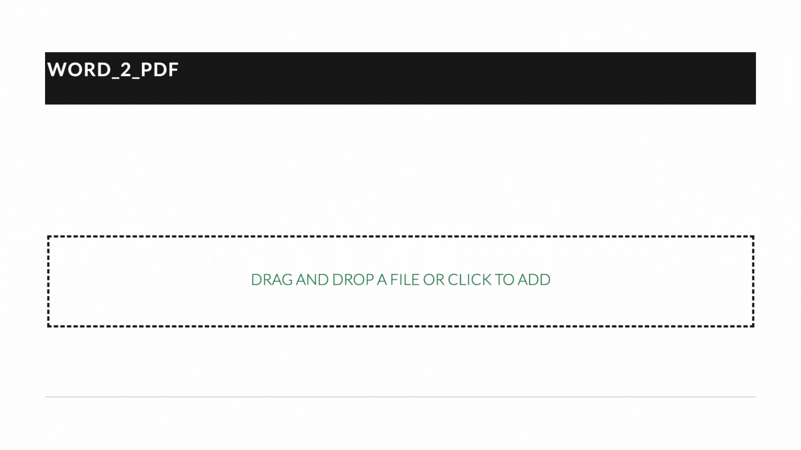

# PDF Converter

<!--  -->

[View it live here](https://pdf-conv-3d1f5.web.app)

## Summary

PDF Converter is a SAAS tool for converting documents, images, files of various formats into PDF format. The tool stores files in a secure [Google Cloud Storage](https://cloud.google.com/storage) bucket, converts files to PDF using a webservice hosted on [Google Cloud Run](https://cloud.google.com/run), and uses [Firebase Cloud Firestore](https://firebase.google.com/docs/firestore) as a real time database for synchronising changes across webservices and clients.
The webservice uses the headless libreoffice linux packages for performing the conversion.

## Motivation

The purpose of this project was to get familiar with Dockerisation of microservices, Docker Compose, Cloud Run, and Firebase Cloud Firestore.

## Getting Started

- Clone/download the repository on your local machine.
- Get service account key from project owner.
- Save service account key in `./app/service_account/your_service_account.json`

### Install dependencies

`./scripts/setup.sh`

### Run PDF Converter from the root directory.

`./scripts/dev.sh`

## Built using

- Docker
- Flask and Flask RestX
- Google Cloud Task
- ReactJS and React-BootStrap
- Firebase Cloud Firestore
- Firebase
- Google Cloud Run

## Features

1. Real time Update of successful conversion.

2. Convert documents of various formats to PDF

3. Drag and Drop Interface
